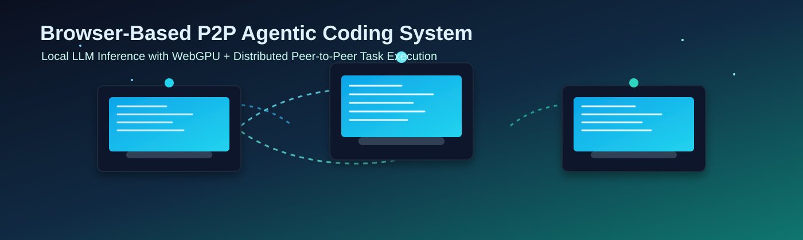
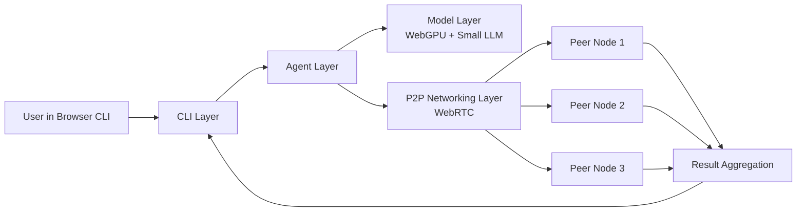
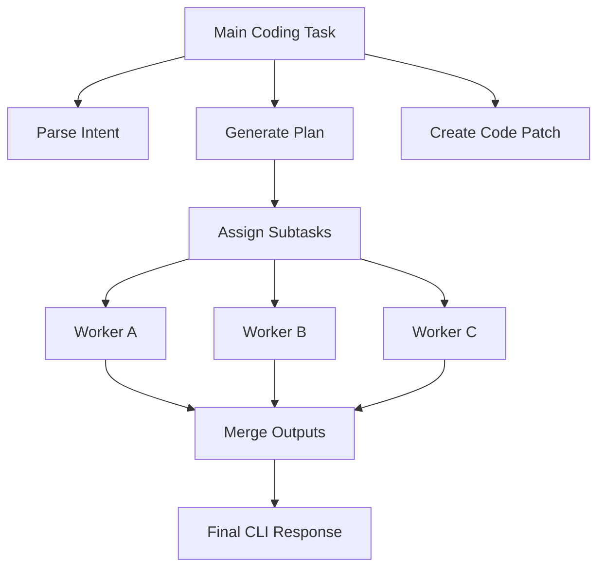

# Browser-Based P2P Agentic Coding System

> **Tagline:** Privacy-first, offline-ready, browser-native distributed coding platform.

---

## 1) Introduction

**Browser-Based P2P Agentic Coding System** ekta browser-based CLI platform, jekhane multiple devices mile distributed coding task run korte pare. Ei system-er main vision holo: local device e small LLM run kore collaborative coding support deya, without cloud dependency.

Eta **offline capability** consider kore design kora, jate internet na thakleo local setup e system cholte pare. Sathe sathe, eta **privacy-first architecture** follow kore, mane user code, prompts, and intermediate data external API te pathano hoy na by default.

---

## 2) Objectives

Project-er clear goals:

- Browser-based CLI experience provide kora for coding workflow.
- WebGPU use kore local machine e small LLM inference run kora.
- P2P network-e task share kore distributed compute utilize kora.
- External API dependency avoid kora.
- Fault-tolerant execution ensure kora jate node failure holeo system continue korte pare.
- Offline and local-network mode support kora.

---

## 3) System Overview

System-ta emon vabe design kora jekhane multiple laptops direct peer-to-peer connection e join korte pare. Kono central compute server chara prottek node task receive, execute, and respond korte pare.

Ekta node user-facing command accept korte pare, arekta node worker hisebe sub-task process korte pare, abar onno node coordination help korte pare. Ei decentralized approach distributed coding workflow ke lightweight and scalable banay.

---

## 4) Technologies Used

### WebGPU
Local GPU acceleration er jonno use hoy. Browser environment thekei model inference fast korte help kore.

### Small LLMs
Compact language models use kora hoy jate consumer laptop hardware e run kora possible hoy.

### WebRTC
Peer-to-peer communication layer hisebe use hoy. Direct node-to-node data exchange and task transfer handle kore.

### IndexedDB
Persistent client-side storage hisebe use hoy. Session state, queued tasks, and recovery data store kore.

### JavaScript, HTML, CSS
Pure web stack diye runtime and UI implement kora hoy:
- JavaScript: orchestration, CLI logic, networking
- HTML: interface structure
- CSS: responsive and usable visual layout

---

## 5) System Architecture

System architecture layered:

### CLI Layer
- User command input and output management
- Task status and logs display

### Agent Layer
- User intent theke executable task plan create
- Complex prompt ke sub-task e split
- Result aggregate kore final output build

### Model Layer
- Local LLM loading and inference control
- WebGPU runtime integration

### P2P Networking Layer
- Peer discovery and connection management
- Task delegation, result return, and node health signals

---

## 6) Distributed Task Execution

Distributed execution flow:

1. User CLI te coding task submit kore.
2. Agent layer task-ke multiple smaller unit e split kore.
3. Scheduler available nodes-er capability check kore assignment day.
4. Worker nodes locally inference run kore.
5. Results origin node e back ashe.
6. Final response compose hoy and CLI te show kore.

Ei process parallelism baray and total response time komay, especially jokhon multiple laptops active thake.

---

## 7) Privacy and Security

### No External Servers
Core workflow e external inference server lage na. Computation local and peer-level e thake.

### Local-Only Processing
Code snippets, prompts, and context local environment e process hoy.

### Peer Authentication and Authorization
- Trusted peers only connect korte pare.
- Session join er age identity validation thake.
- Permission-based task sharing policy maintain kora jay.

---

## 8) Fault Tolerance and Robustness

System resilience features:

- **Node failure handling:** Worker unavailable hole pending task queue te fire ashe.
- **Disconnection recovery:** Temporary disconnect hole reconnection attempt hoy.
- **Task reassignment:** Timeout or failure detect hole task healthy node e reassign hoy.

Ei mechanism gulo ensure kore je single node issue pura workflow block na kore.

---

## 9) Offline Capability

System internet charao run korte pare, jodi required assets age theke available thake:

- Local model files cached thakle inference possible.
- LAN-based peer connection e distributed execution cholbe.
- Air-gapped demo environment eo core features show kora jay.

---

## 10) State Persistence and Recovery

Browser close/reopen scenario handle korar jonno IndexedDB use kora hoy:

- Task queue state save thake
- Session metadata persist hoy
- Last known peer/session info store thake

App reopen hole recovery module previous state reload kore and incomplete task retry policy apply kore.

---

## 11) Demo Description

### Single Node Demo
- One browser instance e local LLM run
- CLI input to output full loop demonstration

### Two-Node Connection Demo
- Laptop A and Laptop B connect via WebRTC
- A node task split kore B node ke sub-task day
- B compute kore result pathay
- A final output merge kore show kore

### Runtime Environment Setup
- Modern Chromium-based browser with WebGPU support
- Same local network for easy peer connectivity
- Preloaded small model artifacts

---

## 12) Limitations

Current constraints:

- WebGPU browser support sob device e equal na
- Small models er reasoning depth limited hote pare
- Performance strongly hardware-dependent
- Very large context tasks e memory pressure barte pare
- P2P connectivity setup network condition-er upor depend kore

---

## 13) Future Improvements

Potential next upgrades:

- Smarter distributed scheduler with adaptive load balancing
- Better model runtime optimization and quantization profiles
- Improved UI with live peer/task observability dashboard
- Stronger identity and policy-based trust model
- Larger scale multi-node mesh support

---

## 14) Conclusion

Browser-Based P2P Agentic Coding System dekhay je browser ecosystem use kore fully local, decentralized, and privacy-conscious AI coding infrastructure build kora possible. WebGPU local inference + WebRTC P2P networking combination e system-ta cloud API charao collaborative coding support korte pare.

Academic submission, portfolio showcase, and practical prototype hisebe ei project modern web capabilities and distributed AI system design er strong example.

---

## Architecture Graph (GitHub Mermaid)

## Distributed Task Graph

